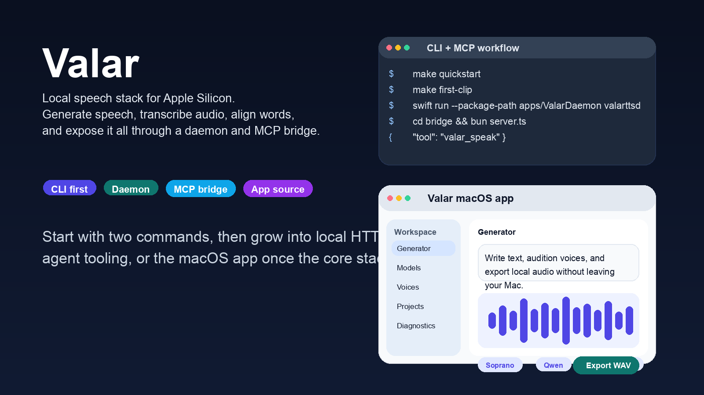
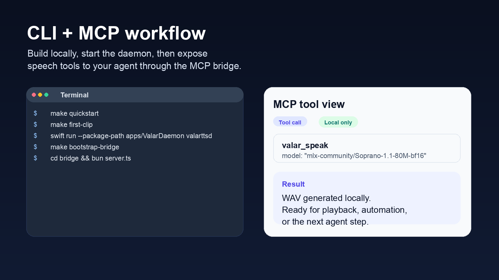
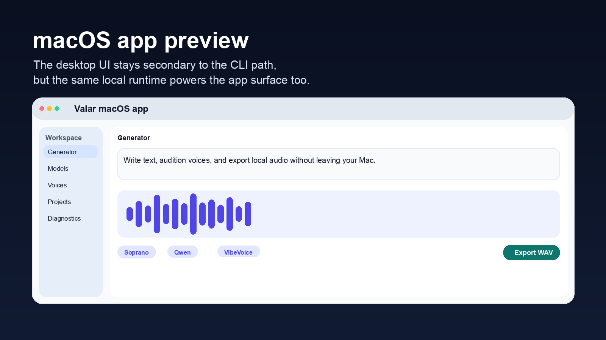

# Valar

[](./LICENSE)




Local speech stack for Apple Silicon: TTS, ASR, forced alignment, voices, daemon, and MCP bridge.

Valar runs locally on macOS with a CLI, a loopback daemon, and an MCP bridge for agents. The fastest path is still CLI first. Once that works, you can add the local HTTP daemon, the MCP bridge, or the macOS app source.

## What Valar Does

- Generate speech locally with small and large Apple Silicon-friendly model families
- Transcribe audio and produce alignment timestamps without a cloud inference backend
- Create and reuse voices through the CLI, daemon, and app surfaces
- Expose a localhost daemon and MCP bridge for agent and automation workflows

## Quick Start

```bash
make quickstart
make first-clip
```

That writes a starter WAV under your macOS temp directory by default, usually at `$TMPDIR/valar-first-clip.wav`. Override it with `VALAR_FIRST_CLIP_OUTPUT=/absolute/path.wav`.

If `make quickstart` reports a missing Metal toolchain, fix Xcode first:

```bash
xcodebuild -downloadComponent MetalToolchain
xcodebuild -runFirstLaunch
```

If you already use another Valar checkout on the same Mac, isolate this repo while testing:

```bash
export VALARTTS_HOME="$PWD/.valartts-public-home"
```

## Choose Your Model

| Goal | Start with | Why |
| --- | --- | --- |
| Prove your machine works | `Soprano` | Smallest, fastest first clip |
| Main narration / stable speech | `Qwen Base` | Primary supported TTS lane |
| Voice design and saved speakers | `Qwen VoiceDesign` | Text-driven voice creation that stays inside the main Qwen family |
| Transcription or timestamps | `Qwen ASR` / `Qwen ForcedAligner` | Main supported ASR and alignment lane |
| Fast preset voices | `VibeVoice` | Preview-only preset voice lane, English-first |
| Multilingual preset voices with extra license limits | `Voxtral` | Explicit non-commercial opt-in only |

See [docs/working-models.md](./docs/working-models.md) for exact install IDs, support posture, footprint, and license notes.

## Agent And MCP Workflow

Once the local CLI path works, the next public integration step is the MCP bridge:

1. Start the daemon: `swift run --package-path apps/ValarDaemon valarttsd`
2. Install bridge dependencies: `make bootstrap-bridge`
3. Start the bridge: `cd bridge && bun server.ts`
4. Point your MCP-capable client or agent at the local bridge

The bridge is optional. Bun is only required if you want MCP or advanced automation.

<p>
  
  
</p>

## App Source

The macOS app source is included, but it is intentionally a secondary path. Build it from Xcode after the CLI path works:

- [docs/app-from-xcode.md](./docs/app-from-xcode.md)
- [docs/xcode-troubleshooting.md](./docs/xcode-troubleshooting.md)

## Learn More

- [docs/prerequisites-and-expectations.md](./docs/prerequisites-and-expectations.md)
- [docs/working-models.md](./docs/working-models.md)
- [docs/model-quickstart.md](./docs/model-quickstart.md)
- [docs/faq.md](./docs/faq.md)
- [docs/use-cases.md](./docs/use-cases.md)
- [docs/integrations.md](./docs/integrations.md)
- [docs/lineage-upstream-references.md](./docs/lineage-upstream-references.md)

## Support, Security, And License

- [CONTRIBUTING.md](./CONTRIBUTING.md)
- [SUPPORT.md](./SUPPORT.md)
- [CODE_OF_CONDUCT.md](./CODE_OF_CONDUCT.md)
- [SECURITY.md](./SECURITY.md)
- [PRIVACY.md](./PRIVACY.md)
- [LICENSE](./LICENSE)

Repo code is MIT. Model weights keep their own upstream licenses.
